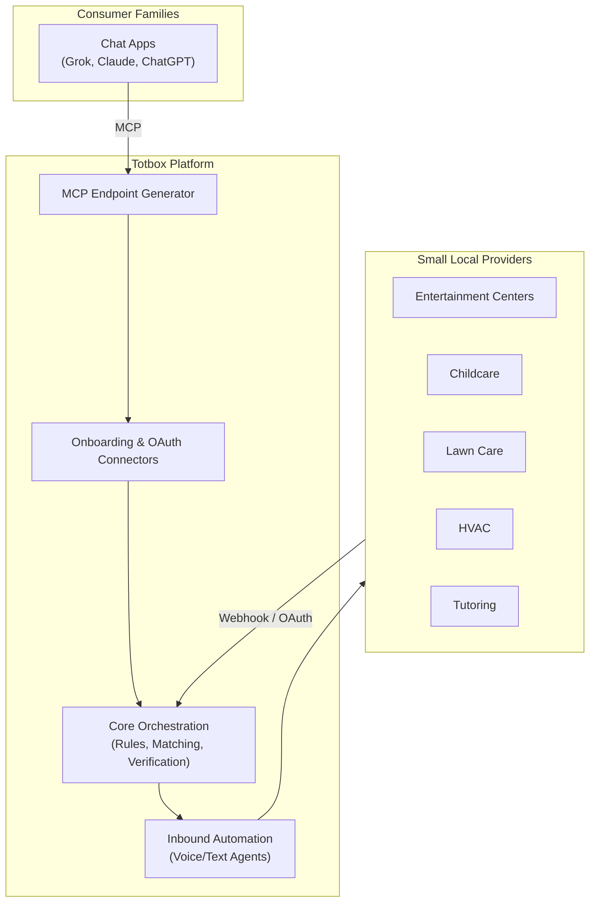
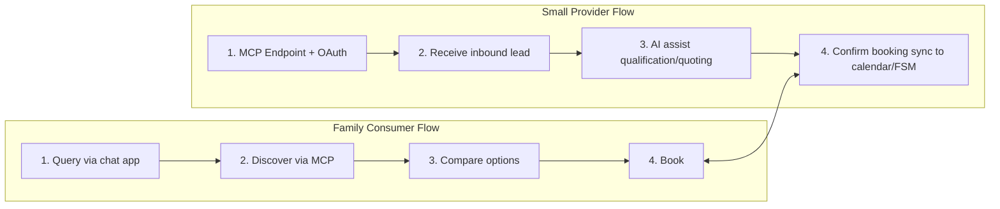

# Totbox

**Disappear the logistics of family life.**

Totbox helps small local operators in family life services reduce back-office admin and booking hassle so they can focus on in-person experiences. At the same time, it helps busy families cut the chore of researching, comparing, and booking these services.

We start with high-frequency, high-pain categories (kids’ activities & entertainment centers, childcare/after-school, tutoring, sports programs, lawn care, pest control, recurring home maintenance like HVAC and cleaning) and expand from there.

**Core Approach**
- Minimal friction: No new app fatigue. Everything happens primarily in the chat apps you already use (Grok, Claude, ChatGPT, etc.) via simple MCP endpoints + OAuth.
- Dual-sided value: Families get fast discovery and booking. Small providers get less admin and more time delivering great in-person experiences.
- Built on real pain: High-frequency coordination and scheduling friction that affects both families and small local operators.

**Current Focus (Beachhead)**  
Family life services — starting with entertainment centers, kids’ activities, childcare, tutoring, lawn care, pest control, and recurring home maintenance.

See the full detailed plan in [`docs/totbox_product_spec.md`](docs/totbox_product_spec.md).

---

## Quick Start

**For Families**  
Just open your favorite chat app and start asking naturally:
- “Find weekend birthday party options for an 8-year-old in Austin under $300”
- “Book 2 HVAC tune-ups next week and after-school care”

**For Providers (Small Operators)**  
Add the Totbox MCP endpoint in your chat app + connect your existing calendar/scheduling tool (Google Calendar or basic scheduler). Inbound requests get qualified and booked with minimal manual work.

Onboarding typically takes under 10 minutes.

---

## Architecture

---

## User Flows

---

## Why This Direction

- Strong shared pain on both sides (families and small operators).
- High frequency + urgency = fast validation and conversion.
- Low-friction design (MCP + existing tools) matches real 2026 user behavior.
- Clear path to quick wins while building defensibility through standardization.

---

## Contributing / Early Collaboration

This is an evolving product. Feedback from families and small operators is extremely valuable.

- Full product plan: [`docs/totbox_product_spec.md`](docs/totbox_product_spec.md)
- Issues and discussions welcome

**License:** Apache-2.0

---

*Built to make family life logistics disappear — so families and the small operators who serve them can focus on what matters.*