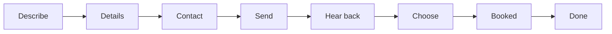

# Totbox workflow interchange format

**Status:** stable for `house_service_v1`  
**Code:** `src/lib/workflow-format.ts` (Zod schemas + projections)  
**Instance map:** `src/lib/workflow-progress.ts`

## Goals

| Goal | How the format helps |
|------|----------------------|
| Consumer transparency | Same step ids + plain `you_do` / `app_does` everywhere |
| UX friendliness | Hosts paint natively from structured fields; text hosts use `strip` |
| Inspectability | `developer` facet on progress; definition is versioned and testable |
| Cross-client | JSON over MCP; diagrams are **projections**, not a second source of truth |

## Layers

| Layer | Encoding | Owner |
|-------|----------|--------|
| **Source of truth** | `totbox.workflow_def` / `totbox.workflow_progress` (JSON) | Totbox PM |
| **Text projection** | one-line `diagram` / `strip` | Derived |
| **Diagram projection** | **Mermaid** `flowchart` | Derived |
| **Semantic dialect** | BPMN *vocabulary* (`userTask`, `serviceTask`, sequence) | Documented mapping |
| **Non-goal** | Full BPMN 2.0 XML as runtime / MCP payload | — |

**Rule:** if a projection disagrees with JSON, **JSON wins**. Mermaid and ASCII are regenerated from the definition or progress snapshot.

---

## Format: `totbox.workflow_def` (template)

Stable process spine (no live job). Returned by `get_workflow` / `get_workflow({ service_kind })` as:

- **`definition`** — full `totbox.workflow_def` object  
- **`steps` / `diagram` / `diagrams`** — convenience summaries (same spine)

```json
{
  "format": "totbox.workflow_def",
  "format_version": "1.0",
  "workflow_id": "house_service_v1",
  "workflow_version": "1.0.0",
  "semantics": "bpmn_sequence_subset",
  "topology": "linear_spine",
  "steps": [
    {
      "n": 4,
      "id": "send",
      "label": "Send",
      "type": "userTask",
      "you_do": "Review and approve the message before anything goes out.",
      "app_does": "Sends via your tools or records a dry-run.",
      "checklist_ids": ["send_outreach"],
      "gates": ["send_message"]
    }
  ],
  "edges": [
    { "from": "describe", "to": "details" }
  ]
}
```

### Field notes

| Field | Meaning |
|-------|---------|
| `format` / `format_version` | Interchange id; bump only with a written migration note |
| `workflow_id` / `workflow_version` | Product spine id (e.g. `house_service_v1`) |
| `semantics` | Always `bpmn_sequence_subset` for v1 — BPMN concepts, not full metamodel |
| `topology` | `linear_spine` — no consumer-facing gateways; loops stay inside steps |
| `steps[].type` | `userTask` (needs human) or `serviceTask` (app/host work) or `none` |
| `steps[].gates` | Optional safety approval kinds at this step |
| `edges` | Sequence only for v1; enables diagram generators |

---

## Format: `totbox.workflow_progress` (instance)

Live “where am I?” overlay on the same spine. Embedded in `get_job` / `get_workflow({ job_id })` as `progress` (plus `format` fields on the progress object).

```json
{
  "format": "totbox.workflow_progress",
  "format_version": "1.0",
  "workflow_id": "house_service_v1",
  "workflow_version": "1.0.0",
  "service_kind": "hvac",
  "summary": "Send: Waiting on your approval.",
  "strip": "✓ Describe · ✓ Details · ✓ Contact · ⚠ Send · ○ Hear back · ○ Choose · ○ Booked · ○ Done",
  "role_line": "You: Review and approve the message…",
  "current_step_id": "send",
  "steps": [
    {
      "id": "send",
      "label": "Send",
      "state": "needs_you",
      "you_do": "…",
      "app_does": "…"
    }
  ],
  "diagrams": {
    "text": "1.Describe → 2.Details → …",
    "mermaid": "flowchart LR\n  …"
  },
  "developer": { }
}
```

### Visual states (closed enum)

| State | Mark | Meaning |
|-------|------|---------|
| `done` | ✓ | Finished |
| `current` | ● | Active, app/host working |
| `needs_you` | ⚠ | Waiting on homeowner |
| `blocked` | ⛔ | Missing fact / hard stop |
| `upcoming` | ○ | Not yet |

Exactly one of `current` | `needs_you` | `blocked` should be in focus for the consumer strip.

---

## Projections

| Projection | Field | Best for |
|------------|-------|----------|
| Strip | `strip` + `role_line` | Mobile chat, SMS-like hosts |
| Text diagram | `diagram` / `diagrams.text` | One-line maps |
| Mermaid | `diagrams.mermaid` | Docs, GitHub, rich hosts that render Mermaid |
| ASCII multi-line | `formatProgressAscii` | CLI / logs |

### Mermaid example (template)



Instance overlays may style the focus step (e.g. `needs_you` highlighted). Styling is optional; structure must remain valid Mermaid.

---

## BPMN alignment (dialect, not engine)

| Totbox | BPMN idea |
|--------|-----------|
| Linear `edges` | `sequenceFlow` |
| Step with homeowner action / gate | `userTask` |
| Step primarily app/host work | `serviceTask` |
| Chase / multi-vendor loops | Stay **inside** a step — not new consumer nodes |
| Full BPMN XML | **Out of scope** for MCP and consumer UI |

Future Camunda-style export can map from this JSON; do not reverse that dependency.

---

## Host render contract (minimum)

1. Always show **`strip`** (or build from `steps[].state` + `label`).
2. Always show **`role_line`** (or current step’s `you_do` / `app_does`).
3. If `next_needs_you` / `needs_you`, highlight the human gate.
4. Offer Mermaid or step cards only if the host can paint them.
5. Show `developer` only when the user asks for under-the-hood detail.
6. Do not invent a different top-level diagram per service kind.

---

## Versioning

- `format_version` **1.0** — additive fields allowed; do not renumber the 8 consumer steps lightly.
- `workflow_version` tracks the product spine (`house_service_v1` content).
- Breaking changes require a new `workflow_id` or a migration note in this file + tests.

---

## Related

- Consumer story: [`house_service_v1.md`](house_service_v1.md)
- Safety gates: [`../host_llm_safety.md`](../host_llm_safety.md)
- MCP tools: [`../mcp_workflow_architecture.md`](../mcp_workflow_architecture.md)
- Sample UI: `/workflow` in the Next app
